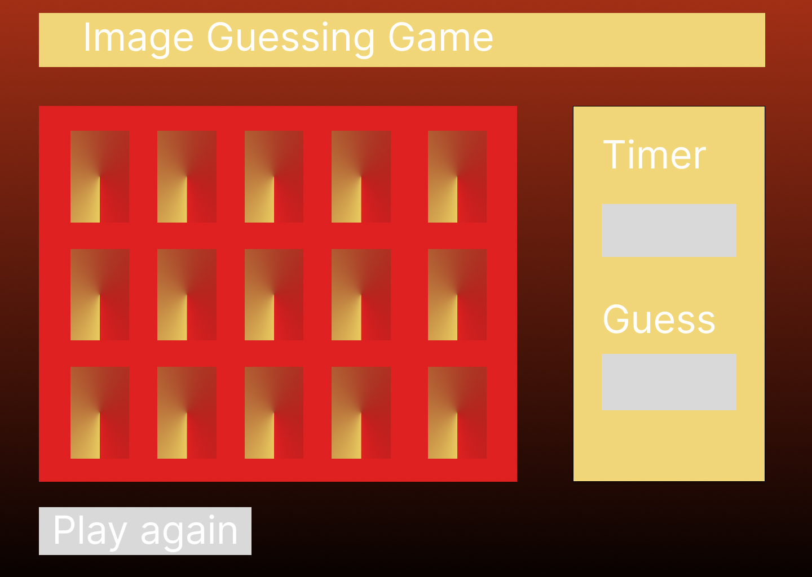

<h1>Plan for the game</h1>

<h2>Cardi E: A card guessing</h2>

<p><em>Description: </em>I want to build a single player game, that make the user choose between 16 cards. 
When two identical cards are flipped, they stay at flip position (meaning you guessed one set)
else if the two card aren't identical, the cards return back to their flip position.
For each game, there should be a 2 set of 8 cards positioned at random and a set amount of time to finish the game.
Each cards will be chosen at random with math.random. Before adding a card at the position Math.random selected, we check if there was any cards present. When all cards are flipped before timer ends, You win, else, you lose<p>

<h2>Design</h2>
<ul>
    <li>16 boxes representing each card</li>
    <li>Cards flips on click</li>
    <li>Timer to track how long before game ends</li>
    <li>Number of guesses</li>
    <li>font:</li>
</ul>

<h2>CSS rules:</h2>
<pre>
font-family: '',sans-serif;
</pre>
<h2>Wireframe</h2>


<h2>Pseudocode</h2>
<ol>
<li>
Define required constants:
    <ul>
        <li></li>
        <li></li>
        <li></li>
    </ul>
</li>
<li>
Define required variables used to track the state of the game:
    <ul>
        <li></li>
        <li></li>
        <li></li>
    </ul>
</li>
<li>
cache DOM elements:
    <ul>
        <li></li>
        <li></li>
        <li></li>
    </ul>
</li>
<li>
Upon loading, the app should:
    <ul>
        <li></li>
        <li></li>
        <li></li>
    </ul>
</li>
<li>
Handle the player clicking a button:
    <ul>
        <li></li>
        <li></li>
        <li></li>
    </ul>
</li>
<li>
Handle the player clicking the play again button:
    <ul>
        <li></li>
        <li></li>
        <li></li>
    </ul>
</li>
</ol>

<h2>
App's state:
</h2>

```
const images = ["url"]; //array of all images url we will use in this game
const boxValues = []; //
const Score = {
    timer:"00:00" //countdown timer
    turn:0  //count how many boxes are clicked
    guesses:0 // updates every 2 turns and shows how many right guesses the user have
};
```
